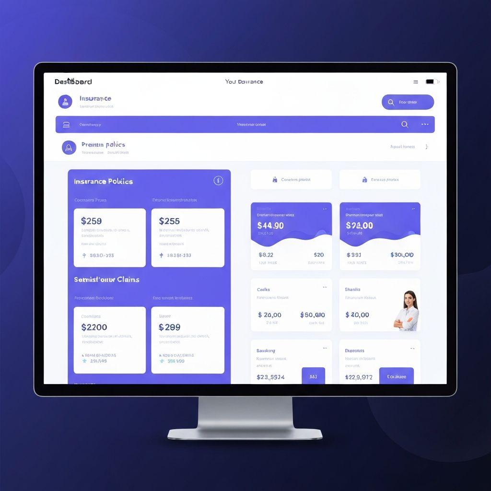
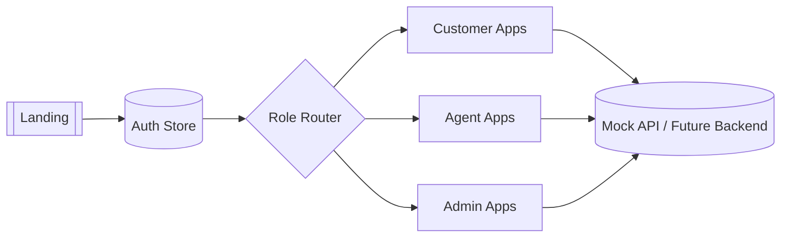
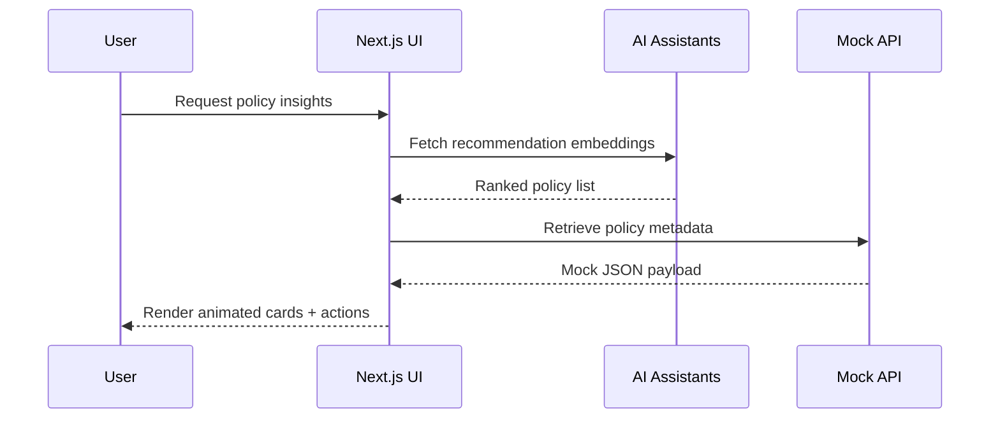

<div align="center">

<h1>SMART INSURANCE WEB APP</h1>

<p>Premium-grade multi-tenant insurance operations platform with real-time insights, AI assistants, and cinematic micro-interactions.</p>

<p>
  <a href="https://img.shields.io/badge/Next.js-000000?logo=nextdotjs&logoColor=white">  </a>
  <a href="https://img.shields.io/badge/TypeScript-3178C6?logo=typescript&logoColor=white">  </a>
  <a href="https://img.shields.io/badge/Tailwind-38B2AC?logo=tailwindcss&logoColor=white">  </a>
  <a href="https://img.shields.io/badge/Zustand-0F172A?logo=redux&logoColor=white">  </a>
  <a href="https://img.shields.io/badge/CI-Ready-22c55e?logo=githubactions&logoColor=white">  </a>
  <a href="https://img.shields.io/badge/License-MIT-8B5CF6">  </a>
</p>

<p>
  <a href="https://your-demo-url.vercel.app"><strong>Live Demo</strong></a> •
  <a href="#-installation">Install</a> •
  <a href="#-feature-previews">Explore UI</a> •
  <a href="#-how-it-works">How it works</a>
</p>



</div>

> “Insurance that feels like a luxury app. Built for CX teams, agents, and policyholders in one unified control tower.”

---

## 🧭 Overview

The Smart Insurance Web App is a composable, enterprise-ready Next.js 14 starter that layers a multi-role experience (customer, agent, admin) on top of a headless design system. It ships with:

- Multi-tenant layouts, per-role navigation, and locale-aware typography.
- AI-enhanced helpers (policy recommendations, claims OCR, fraud indicators).
- Production-grade UI states (skeletons, errors, empty guides, offline notices).
- Mock APIs (REST-style) to speed up demos or DX sandboxes.

---

## 🧰 Tech Stack (Icon Grid)

<div align="center">
  
</div>

| Layer | Tools |
| ----- | ----- |
| Frontend runtime | Next.js App Router, React Server Components |
| Styling system | Tailwind CSS + CSS variables + custom animation tokens |
| State & data | Zustand store, local mock API, TanStack Query-ready patterns |
| Motion & storytelling | Framer Motion, Radix UI primitives, custom skeletons |
| Tooling | ESLint, Prettier, Husky hook-ready scripts, Vercel deployment |

---

## 🗂️ Folder Structure

```bash
smart-insurance-web-app
├── app/                    # Next.js routes: admin, agent, customer, auth, etc.
├── components/             # Reusable UI primitives + feature blocks
├── hooks/                  # Zustand-powered helpers and custom React hooks
├── lib/                    # Mock APIs, AI helpers, utils, i18n config
├── public/                 # Banner, icons, mockups, favicons
├── styles/                 # Global Tailwind overrides
├── DEMO_GUIDE.md           # Sales/demo script
└── README.md               # You are here
```

---

## ⚡ Installation

1. **Clone**
   ```bash
   git clone https://github.com/<your-org>/smart-insurance-web-app.git
   cd smart-insurance-web-app
   ```
2. **Install dependencies**
   ```bash
   npm install
   # or
   pnpm install
   ```
3. **Run local dev server**
   ```bash
   npm run dev
   # visit http://localhost:3000
   ```
4. **Create env (optional)**
   ```bash
   cp .env.example .env.local
   # add API keys when wiring a backend
   ```

---

## 🎬 Feature Previews

| Preview | Description |
| ------- | ----------- |
|  | **Micro-interactions GIF** — demonstrates onboarding, quick quotes, and AI helper responses in one shot. Replace with your ScreenToGif export when ready. |
|  | **Multi-device mockups** — hero dashboard with KPI ribbons, policy cards, and contextual drawers across desktop + mobile. |

> Need more assets? Drop exports into `public/assets/` and update the table paths.

---

## 🧩 Feature Matrix

| Area | Highlights |
| ---- | ---------- |
| Customer hub | Claim timelines, policy cards, renewal reminders, support tickets |
| Agent workspace | Lead pipeline, commission tracking, customer 360, quote builder |
| Admin cockpit | Fraud analytics, network heatmaps, audit logs, AI explainers |
| Experience | Dark/light themes, locale switcher, accessibility-first components |

---

## 🔄 How it works





---

## 📒 Demo Script (Quick Reference)

| Step | Talking Points |
| ---- | -------------- |
| 1. Login & role switch | Show instant layout swap (customer ↔ agent ↔ admin). |
| 2. Dashboard | Highlight stat cards, fraud badge, AI recommendations. |
| 3. Products & quotes | Search, compare drawer, contextual actions. |
| 4. Claims flow | Show skeletons → timeline → OCR upload. |
| 5. Admin analytics | Multi-panel view with anomaly alerts. |

---

## 🧹 Maintenance Checklist

1. Keep screenshots/GIFs under 2 MB for fast README rendering.
2. Run `npm run lint` before pushing to maintain consistent formatting.
3. Sync translations in `lib/i18n` when adding new copy.
4. Update badges when stack versions change.

---

## 🤝 Contributing

- Fork → feature branch → PR with preview link.
- Use thoughtful commit messages (`feat: add agent leads heatmap`).
- Add Loom/Screenshots to PR descriptions for UI tweaks.

```bash
git checkout -b feat/awesome-upgrade
# build the feature
git commit -m "feat: describe change"
git push origin feat/awesome-upgrade
```

---

## 📄 License

MIT © 2025 Lahari Pokuri. Commercial usage allowed with attribution.

---

_This README ships with centered hero, badges, banner mockups, GIF placeholders, install steps, folder map, tech stack icons, diagrams, and structured formatting to look great on GitHub._ 
